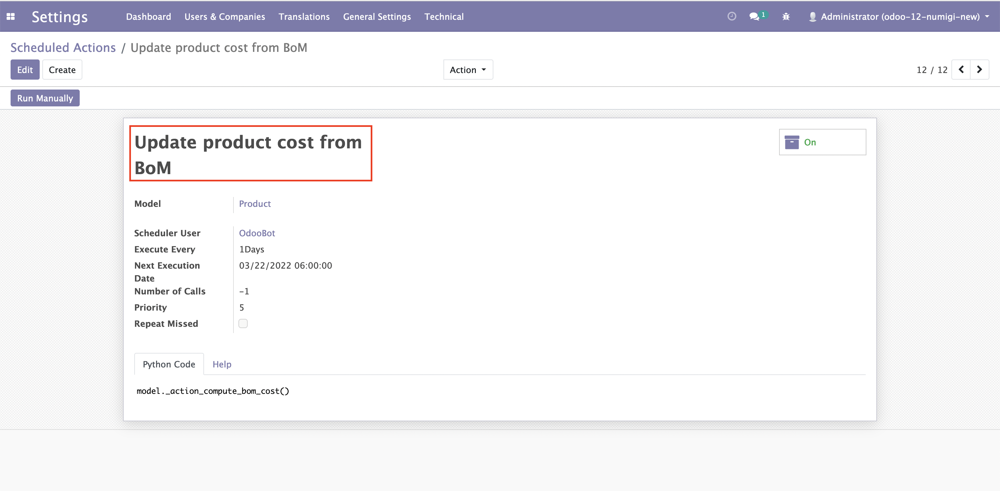
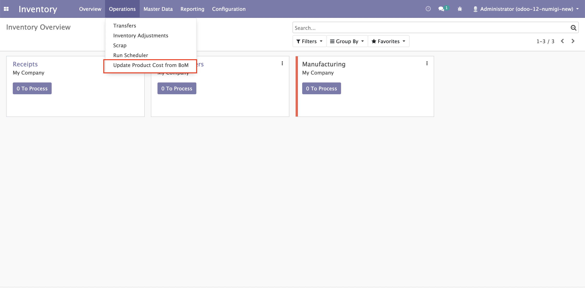
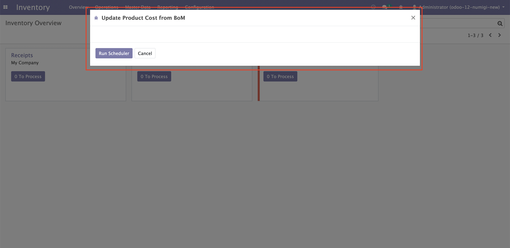

MRP BoM Cost Scheduled Action
=============================
Description
-----------
This module add a new Scheduler Action to call the function "Compute price from Bom" for all products which has BOM

This module will also add a new menu: Inventory -> Operations -> Update Product Cost from BoM. Can only be accessed by Inventory Manager

When open the menu a Run Compute BoM Cost popup will be shown. Run Scheduler Button will call the same function with Scheduler Action

Configuration
-------------

No configuration required apart from module installation.

Contributors
------------
* Numigi (tm) and all its contributors (https://bit.ly/numigiens)
* Komit (https://komit-consulting.com)

More information
----------------
* Meet us at https://bit.ly/numigi-com
