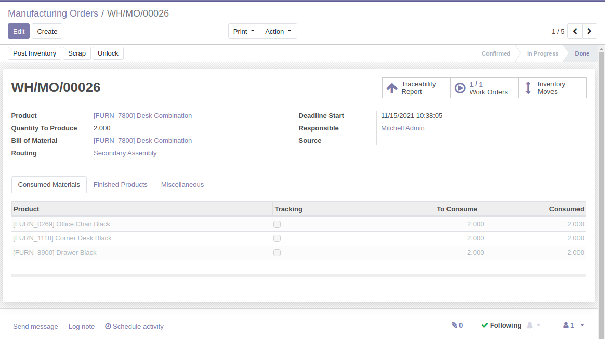
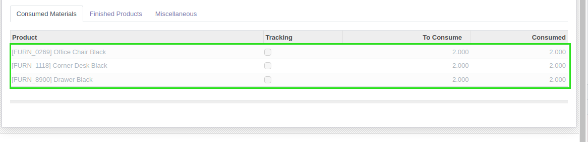
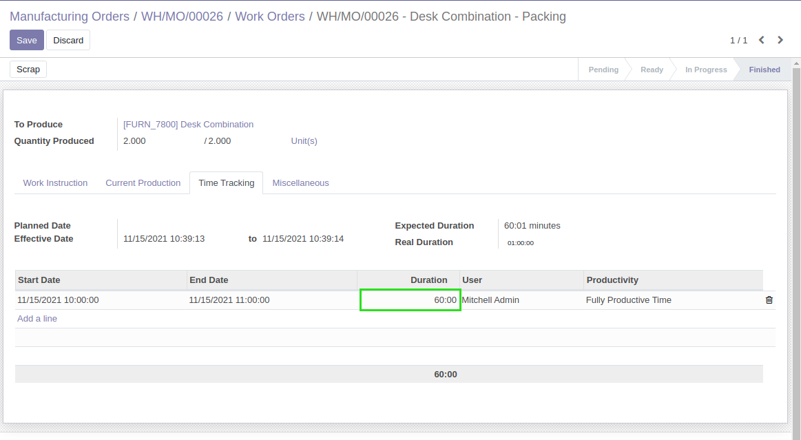
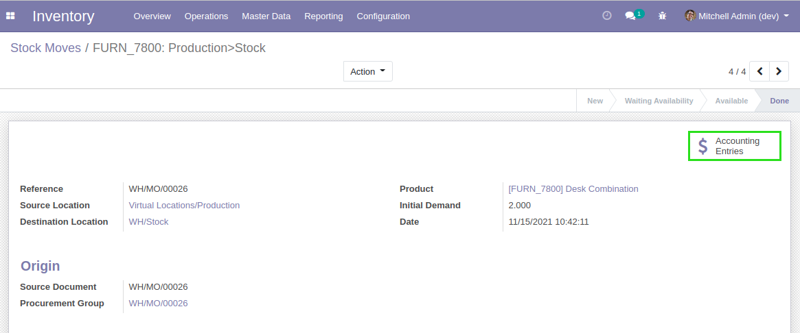
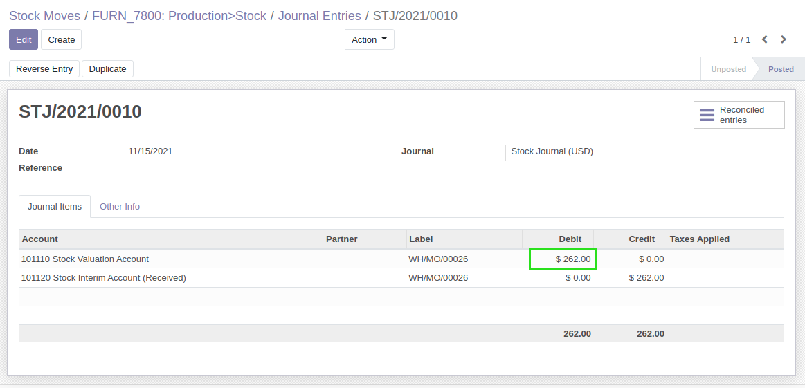

MRP Cost
========

.. contents:: Table of Contents

Context
-------
In community edition of Odoo 12.0, the MRP application does not allow to record the real accounting cost
of produced goods.

For this, you need to install the enterprise edition.

Usage
-----
I create and process a manufacturing order.

I have 3 products with costs per unit of:

* 18$
* 78$
* 20$

I have spent one hour in the work center at the cost of 30$ per hour.

For the two units produced, this makes a total of:

* (18$ + 78$ + 20$) * 2 units + 30$ * 1:00 hour = 262$

I go to the accounting entry generated for my finished product.

I notice that the cost matches the expected amount.

Contributors
------------
* Numigi (tm) and all its contributors (https://bit.ly/numigiens)

More information
----------------
* Meet us at https://bit.ly/numigi-com
