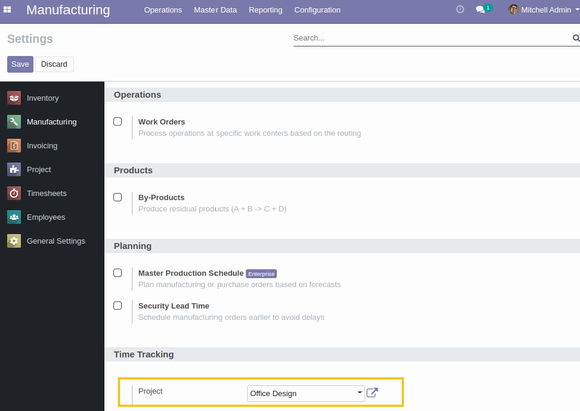
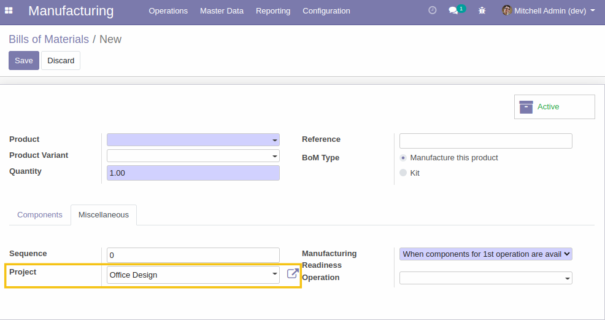
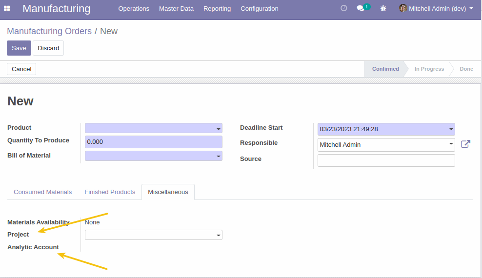
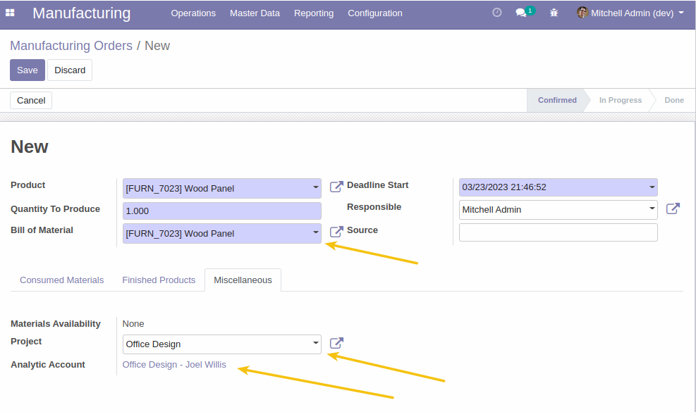
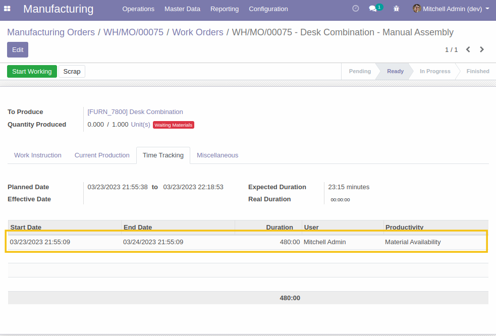
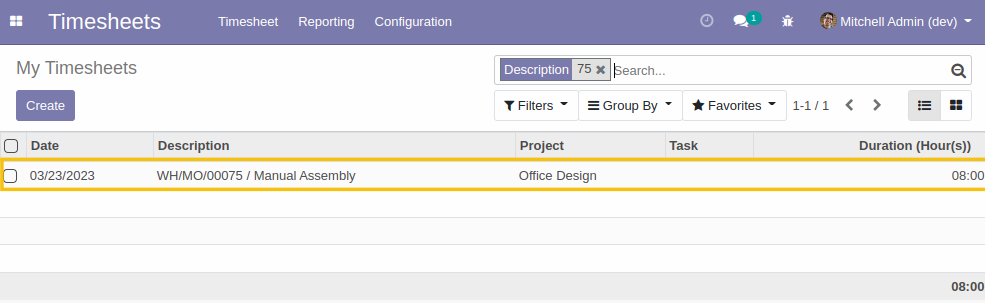

MRP Timesheet
=============
This module allows to visualize the manufacturing orders times in the timesheet.

.. contents:: Table of Contents

Context
-------

Users in the manufacturing department enter times for tasks and projects,
as well as work orders for manufacturing, based on the type of items being produced
or consumed.

The times are monitored and approved at the end of the day or week.

Overview
--------

This module allows the time spent in the manufacturing module to be reported as project timesheet,
in order to control all times in one place through timesheet records.

Configuration
-------------

In ``Manufacturing > Configuration > Settings`` menu , I notice a new field ``Project``

On the bill of materials, I notice a new field ``Project``.
By default, it takes the value defined in the configuration,
but I can adjust it on a case-by-case basis.

Usage
-----

I create a new MO, and I notice two new fields:
1- Project
2- Analytic account

When I select the bill of materials, the project field takes the value of the corresponding
field on the bill of materials.
Depending on the value of the Project field,
the Analytic Account field is updated with the analytic account linked to the project.

When time is charged to a work order,
a corresponding analytic line is created in the analytic account defined on the manufacturing order.

I notice that the project is propagated on the analytic account line.

Contributors
------------
* Numigi (tm) and all its contributors (https://bit.ly/numigiens)

More information
----------------
* Meet us at https://bit.ly/numigi-com
