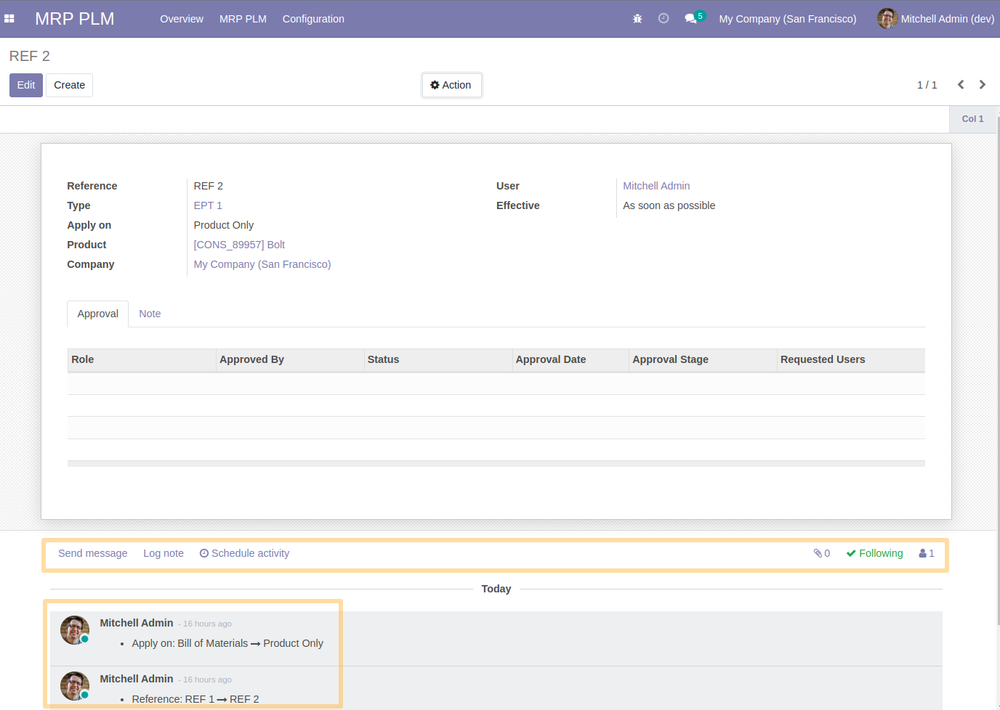

Sync PLM Chatter
================
This module adds the possibility to attach external documents to an ECO (product revision).
It gives also the possibility to trace the modifications of values ​​on a form view of ECO.

Usage
=====
As a user with access to the `MRP PLM` application, I access the form view of an ECO.
When I edit/create a new record, I see the change is tracked in a chatter at the bottom. 
All the fields in the form view are tracked.
In addition, I find new buttons to be able to send notes, messages and create activities.

Contributors
------------
* Numigi (tm) and all its contributors (https://bit.ly/numigiens)
